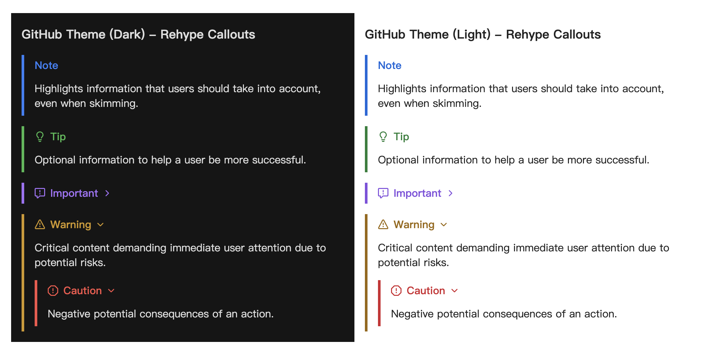

import { Icon } from 'astro-icon/components'

## 文章的 Front-matter

```yaml
---
title: Elaina's Journey
published: 2026-02-13
description: 这是一段伊蕾娜的旅途。
image: ./cover.jpg
tags: [Journey]
category: Journey
draft: false
---
```

| 属性          | 描述                                                                                                                                                                                                 |
|---------------|------------------------------------------------------------------------------------------------------------------------------------------------------------------------------------------------------|
| `title`       | 文章标题。                                                                                                                                                                                          |
| `published`   | 文章发布日期。                                                                                                                                                                                      |
| `updated`     | 文章更新日期。如果未设置，将默认使用发布日期。                                                                                                                                                      |
| `pinned`      | 是否将此文章置顶在文章列表顶部。                                                                                                                                                                    |
| `description` | 文章的简短描述。显示在首页上。                                                                                                                                                                      |
| `image`       | 文章封面图片路径。<br/>1. 以 `http://` 或 `https://` 开头：使用网络图片<br/>2. 以 `/` 开头：`public` 目录中的图片<br/>3. 不带任何前缀：相对于 markdown 文件的路径 |
| `tags`        | 文章标签。                                                                                                                                                                                          |
| `category`    | 文章分类。                                                                                                                                                                                          |
| `lang`        | 文章语言代码（如 `zh-CN`）。仅当文章语言与站点默认语言不同时设置。                                                                                                                                    |
| `licenseName` | 文章内容的许可证名称。                                                                                                                                                                              |
| `licenseUrl`  | 文章内容的许可证链接。                                                                                                                                                                              |
| `author`      | 文章作者。                                                                                                                                                                                          |
| `sourceLink`  | 文章内容的来源链接或参考。                                                                                                                                                                          |
| `draft`       | 如果这篇文章仍是草稿，则不会显示。                                                                                                                                                                  |
| `comment`     | 是否启用此文章的评论功能。默认为 `true`。                                                                                                                                                           |
| `slug`        | 自定义文章 URL 路径。如果不设置，将使用文件名作为 URL。<br/>Slug 会自动转换为小写。<br/>如果多个文章使用相同的 slug，后面的文章会覆盖前面的。                                                                                                                                            |

## MDX 格式

- Markdown (MD) 是一种轻量级标记语言，允许用户使用纯文本格式编写文档，然后将其转换为格式化的HTML。它因其简洁易用的语法而广受欢迎，特别适合编写文档和博客文章。
- MDX 是一种扩展了 Markdown 语法的格式，允许在 Markdown 文档中无缝地插入 JSX 代码。通过 MDX，用户可以在文档中嵌入 React 组件，从而实现更丰富的交互性和动态性。

| 特性 | Markdown | MDX |
| :--- | :--- | :--- |
| 基础语法 | 支持 (CommonMark) | 支持 (CommonMark) |
| HTML 标签 | 支持 | 支持 (作为 JSX) |
| 组件导入 | 不支持 | 支持 (import) |
| 动态数据 | 不支持 | 支持 (JS 表达式) |
| 样式定制 | 有限 (class/style) | 灵活 (className/CSS-in-JS) |

### 使用组件

这是一个图标组件：
```
import { Icon } from 'astro-icon/components'

<div class="flex items-center gap-2 my-4">
  <Icon name="fa7-solid:rocket" class="text-4xl text-red-500" />
  <span>火箭发射！</span>
</div>
```
<div class="flex items-center gap-2 my-4">
  <Icon name="fa7-solid:rocket" class="text-4xl text-red-500" />
  <span>火箭发射！</span>
</div>


### 使用 JSX

你也可以直接写 HTML/JSX：
```
<div className="p-4 bg-blue-100 dark:bg-blue-900 rounded-lg my-4">
  这是一个自定义样式的 div 块，使用了 Tailwind CSS 类。
</div>
```
<div className="p-4 bg-blue-100 dark:bg-blue-900 rounded-lg my-4">
  这是一个自定义样式的 div 块，使用了 Tailwind CSS 类。
</div>

### 简单的变量导出
```
export const year = new Date().getFullYear()

今年是 {year} 年。
```
export const year = new Date().getFullYear()

今年是 {year} 年。


更多信息，请查看 [MDX 文档](https://mdxjs.com/)

## KaTeX 数学公式

### 花括号

$$
\left\{
    x\in \mathbb{R} : x^2 < 4
\right\}
$$

### 矩阵 (Matrices)

$$
\begin{pmatrix}
a & b \\
c & d
\end{pmatrix}
\begin{pmatrix}
\alpha & \beta \\
\gamma & \delta
\end{pmatrix} =
\begin{pmatrix}
a\alpha + b\gamma & a\beta + b\delta \\
c\alpha + d\gamma & c\beta + d\delta
\end{pmatrix}
$$

### 极限与求和 (Limits and Sums)

$$
\sum_{n=1}^{\infty} \frac{1}{n^2} = \frac{\pi^2}{6}
$$

$$
\lim_{x \to 0} \frac{\sin x}{x} = 1
$$

### 麦克斯韦方程组 (Maxwell's Equations)

$$
\begin{aligned}
\nabla \cdot \mathbf{E} &= \frac{\rho}{\varepsilon_0} \\
\nabla \cdot \mathbf{B} &= 0 \\
\nabla \times \mathbf{E} &= -\frac{\partial \mathbf{B}}{\partial t} \\
\nabla \times \mathbf{B} &= \mu_0\mathbf{J} + \mu_0\varepsilon_0\frac{\partial \mathbf{E}}{\partial t}
\end{aligned}
$$

## 提醒框(Admonitions)配置

Firefly 采用了 [rehype-callouts](https://github.com/lin-stephanie/rehype-callouts) 插件，支持了三种风格的提醒框主题：`GitHub`、`Obsidian` 和 `VitePress`。您可以在 `src/config/siteConfig.ts` 中进行配置：

本博客使用了 GitHub 主题风格的提醒框：

这是 GitHub 官方支持的 5 种基本类型。



**基本语法**

```markdown
> [!NOTE] NOTE
> 突出显示用户应该考虑的信息。

> [!TIP] TIP
> 可选信息，帮助用户更成功。

> [!IMPORTANT] IMPORTANT
> 用户成功所必需的关键信息。

> [!WARNING] WARNING
> 关键内容，需要立即注意。

> [!CAUTION] CAUTION
> 行动的负面潜在后果。

> [!NOTE] 自定义标题
> 这是一个带有自定义标题的示例。
```

## 代码块

### 语法高亮

[语法高亮](https://expressive-code.com/key-features/syntax-highlighting/)

#### 常规语法高亮

```js
console.log('此代码有语法高亮!')
```

#### 渲染 ANSI 转义序列

```ansi
ANSI colors:
- Regular: [31mRed[0m [32mGreen[0m [33mYellow[0m [34mBlue[0m [35mMagenta[0m [36mCyan[0m
- Bold:    [1;31mRed[0m [1;32mGreen[0m [1;33mYellow[0m [1;34mBlue[0m [1;35mMagenta[0m [1;36mCyan[0m
- Dimmed:  [2;31mRed[0m [2;32mGreen[0m [2;33mYellow[0m [2;34mBlue[0m [2;35mMagenta[0m [2;36mCyan[0m

256 colors (showing colors 160-177):
[38;5;160m160 [38;5;161m161 [38;5;162m162 [38;5;163m163 [38;5;164m164 [38;5;165m165[0m
[38;5;166m166 [38;5;167m167 [38;5;168m168 [38;5;169m169 [38;5;170m170 [38;5;171m171[0m
[38;5;172m172 [38;5;173m173 [38;5;174m174 [38;5;175m175 [38;5;176m176 [38;5;177m177[0m

Full RGB colors:
[38;2;34;139;34mForestGreen - RGB(34, 139, 34)[0m

Text formatting: [1mBold[0m [2mDimmed[0m [3mItalic[0m [4mUnderline[0m
```

## GitHub 仓库卡片

您可以添加链接到 GitHub 仓库的动态卡片，在页面加载时，仓库信息会从 GitHub API 获取。

::github{repo="yhx1415926/yhx1415926.github.io"}

使用代码 `::github{repo="yhx1415926/yhx1415926.github.io"}` 创建 GitHub 仓库卡片。

```markdown
::github{repo="yhx1415926/yhx1415926.github.io"}
```

## 剧透

您可以为文本添加剧透。文本也支持 **Markdown** 语法。

内容 :spoiler[ **Elaina Forever** ]！

```markdown
内容 :spoiler[ **Elaina Forever** ]！
```

## Markdown 基本语法

### 换行

HTML 标签：`<br />`

在行末添加**两个或更多空格**来产生换行。

### 引用嵌套

> 这是第一层引用。
>> 这是第二层引用。
>>> 这是第三层引用。

